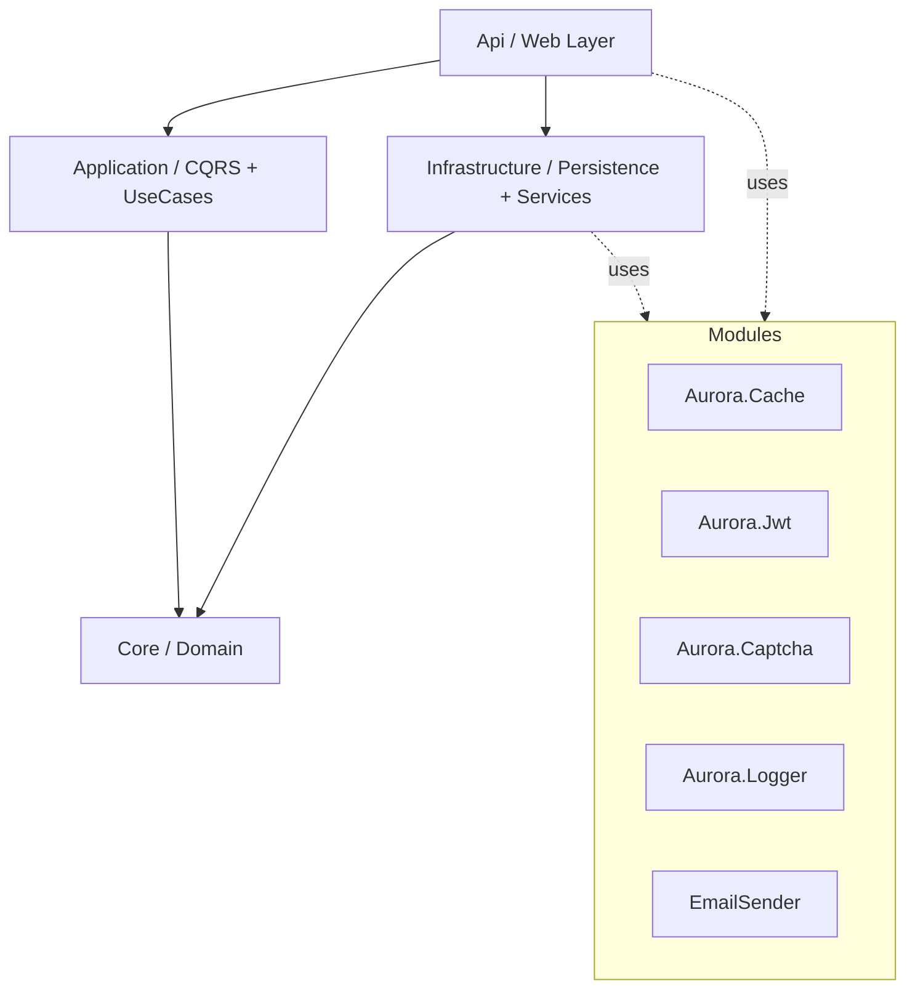
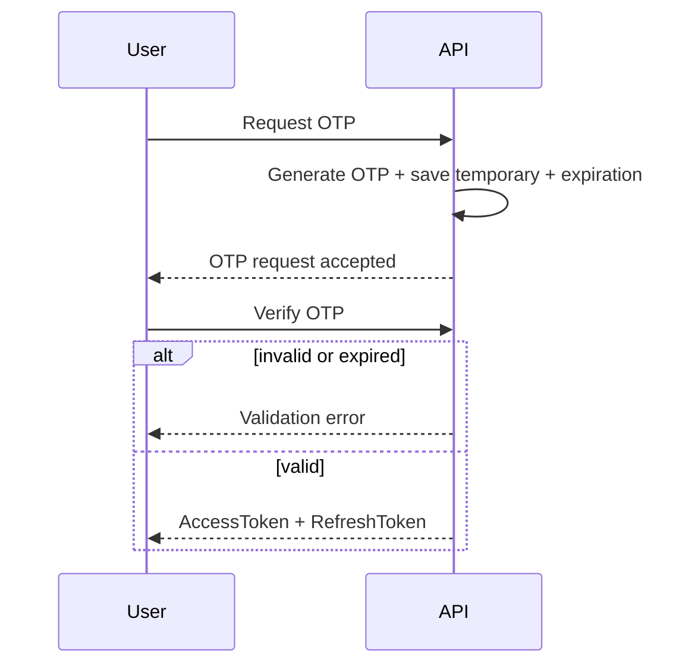

<div align="center">

# 🌟 AuroraBase

### Enterprise .NET 8 Web API Boilerplate (Clean Architecture + CQRS + OTP/JWT)

[](https://dotnet.microsoft.com/)
[](https://learn.microsoft.com/dotnet/csharp/)
[](https://learn.microsoft.com/ef/core/)
[](LICENSE)

**AuroraBase** یک زیرساخت آماده برای توسعه APIهای سازمانی است که با تمرکز بر **Clean Architecture**، **CQRS**، **OTP Authentication**، **JWT Token Management**، **Caching** و **Maintainability** طراحی شده است.

</div>

---

## 📚 فهرست مطالب

- [معرفی پروژه](#-معرفی-پروژه)
- [ویژگی‌های کلیدی](#-ویژگیهای-کلیدی)
- [معماری و جریان وابستگی](#️-معماری-و-جریان-وابستگی)
- [ساختار پروژه](#-ساختار-پروژه)
- [شروع سریع](#-شروع-سریع)
- [پیکربندی کامل](#️-پیکربندی-کامل)
- [راهنمای کامل ماژول‌ها و نحوه استفاده](#-راهنمای-کامل-ماژولها-و-نحوه-استفاده)
  - [Aurora.Cache](#1-auroracache--راهنمای-کامل-کشینگ)
  - [Blacklist Management](#2-blacklist-management--مدیریت-بلکلیست)
  - [Pagination (Offset/Cursor)](#3-pagination--راهنمای-پیجینگ)
  - [Aurora.Jwt](#4-aurorajwt--مدیریت-توکن)
  - [OTP Authentication Flow](#5-otp-authentication-flow)
  - [Aurora.Logger](#6-auroralogger--لاگینگ-و-مانیتورینگ)
  - [Aurora.Captcha](#7-auroracaptcha--وضعیت-فعلی)
  - [EmailSender](#8-emailsender--وضعیت-فعلی)
- [نمونه قرارداد API](#-نمونه-قرارداد-api)
- [بهترین‌تمرین‌ها](#-بهترینتمرینها)
- [مشارکت](#-مشارکت)
- [Roadmap](#-roadmap)
- [License](#-license)

---

## 📖 معرفی پروژه

AuroraBase یک بویلرپلیت قابل توسعه برای پروژه‌های Web API است که زیرساخت‌های پرتکرار را آماده می‌کند تا تیم توسعه روی منطق کسب‌وکار تمرکز کند:

- معماری تمیز و تفکیک مسئولیت
- الگوی CQRS برای خوانایی و توسعه‌پذیری
- احراز هویت مبتنی بر OTP و مدیریت نشست با JWT
- لایه کش و لاگینگ ماژولار
- قابلیت توسعه برای سناریوهای Production

---

## ✨ ویژگی‌های کلیدی

- ✅ Clean Architecture
- ✅ CQRS + MediatR
- ✅ Repository + Unit of Work
- ✅ OTP Login (جریان اصلی ورود)
- ✅ JWT Access/Refresh Token
- ✅ Aurora.Cache (In-Memory/Distributed)
- ✅ Aurora.Logger (Structured Logging)
- ✅ Dual Pagination (Offset + Cursor/Keyset)
- ✅ توسعه‌پذیر برای نیازهای enterprise

---

## 🏛️ معماری و جریان وابستگی



### نقش لایه‌ها

- **Core**: Entityها، قراردادها، Domain Ruleها
- **Application**: Command/Query/Handler، DTO، Validation
- **Infrastructure**: EF Core، Repository، Migration، External Service
- **Api**: Controller، Middleware، DI، Configuration

---

## 📂 ساختار پروژه

```text
AuroraBase/
├── Api/
├── Application/
├── Core/
├── Infrastructure/
├── Aurora.Cache/
├── Aurora.Captcha/             # فعلاً در فلو عملیاتی استفاده نشده
├── Aurora.ChacheSetting/
├── Aurora.Jwt/
├── Aurora.Logger/
├── EmailSender/                # فعلاً استفاده عملیاتی ندارد
└── Utils/
```

---

## 🚀 شروع سریع

### پیش‌نیازها

- .NET SDK 8.0
- SQL Server
- EF CLI (اختیاری)
  ```bash
  dotnet tool install --global dotnet-ef
  ```

### 1) کلون پروژه

```bash
git clone https://github.com/Rezakp3/AuroraBase.git
cd AuroraBase
```

### 2) تنظیمات

فایل `Api/appsettings.json` را مقداردهی کنید:

```json
{
  "ConnectionStrings": {
    "DefaultConnection": "Server=YOUR_SERVER;Database=AuroraBaseDb;Trusted_Connection=True;TrustServerCertificate=True;"
  },
  "JwtSettings": {
    "SecretKey": "YOUR_SUPER_SECRET_KEY_SHOULD_BE_LONG_RANDOM_AND_SECURE",
    "Issuer": "AuroraBase",
    "Audience": "AuroraBaseUsers",
    "AccessTokenExpirationMinutes": 15,
    "RefreshTokenExpirationDays": 7
  },
  "CacheSettings": {
    "AbsoluteExpirationInMinutes": 60,
    "SlidingExpirationInMinutes": 10
  }
}
```

### 3) اجرای Migration

```bash
dotnet ef database update --project Infrastructure --startup-project Api
```

### 4) اجرای API

```bash
cd Api
dotnet run
```

Swagger:
`https://localhost:7001/swagger`

---

## ⚙️ پیکربندی کامل

## ConnectionStrings
- `DefaultConnection`: اتصال دیتابیس SQL Server

## JwtSettings
- `SecretKey`: کلید امضای JWT
- `Issuer`: صادرکننده توکن
- `Audience`: مخاطب توکن
- `AccessTokenExpirationMinutes`: زمان انقضای access token
- `RefreshTokenExpirationDays`: زمان انقضای refresh token

## CacheSettings
- `AbsoluteExpirationInMinutes`: انقضای مطلق
- `SlidingExpirationInMinutes`: انقضای لغزشی

## OTP Settings
بسته به پیاده‌سازی داخلی پروژه، معمولاً شامل:
- طول OTP
- مدت اعتبار OTP
- محدودیت تعداد تلاش
- cooldown بین درخواست‌ها

> اگر کلیدها را سفارشی تعریف کرده‌اید، همینجا مستندسازی کنید.

---

## 🧩 راهنمای کامل ماژول‌ها و نحوه استفاده

## 1) Aurora.Cache — راهنمای کامل کشینگ

### هدف
کاهش فشار روی دیتابیس، کاهش latency و افزایش throughput.

### سناریوهای مناسب کش
- داده‌های خواندنی پرتکرار
- تنظیمات سیستم
- لیست‌های مرجع (Reference Data)
- OTP/Session کوتاه‌مدت (در صورت طراحی)

### الگوی کلیدی نام‌گذاری Key
```
{Module}:{Entity}:{Identifier}
```
مثال:
- `User:Profile:123`
- `Product:List:Page1:Size20`
- `Otp:Login:+98912XXXXXXX`

### الگوی پیشنهادی Cache-Aside
1. ابتدا از کش بخوان
2. اگر نبود، از دیتابیس بخوان
3. نتیجه را در کش ذخیره کن
4. در عملیات write/update کش را invalidate کن

نمونه کد عمومی:

```csharp
public async Task<UserDto> GetUserProfileAsync(Guid userId)
{
    var cacheKey = $"User:Profile:{userId}";
    var cached = await _cache.GetAsync<UserDto>(cacheKey);
    if (cached is not null) return cached;

    var user = await _userRepository.GetByIdAsync(userId);
    var dto = _mapper.Map<UserDto>(user);

    await _cache.SetAsync(cacheKey, dto, TimeSpan.FromMinutes(10));
    return dto;
}
```

### Invalidation Strategy
- بعد از Update/Delete:
  - کلید تک آیتم را حذف کن
  - کلید لیست‌های وابسته را هم حذف کن

```csharp
await _cache.RemoveAsync($"User:Profile:{userId}");
await _cache.RemoveByPrefixAsync("User:List:");
```

> اگر `RemoveByPrefix` ندارید، index key نگه دارید یا versioned key pattern استفاده کنید.

---

## 2) Blacklist Management — مدیریت بلک‌لیست

> این بخش یک راهنمای اجرایی استاندارد است و با OTP/JWT شما سازگار است.

### کاربرد بلک‌لیست
- Logout امن (باطل‌سازی Access Token قبل از Expire)
- مسدودسازی Refresh Token دزدیده‌شده
- بلاک موقت کاربر/دستگاه/IP
- جلوگیری از brute-force

### الگوی پیشنهادی
- هنگام logout:
  - `jti` توکن access را در blacklist ذخیره کن تا زمان انقضای همان توکن
- هنگام refresh:
  - refresh token قبلی را revoke/blacklist کن
  - refresh token جدید صادر کن (rotation)
- در middleware احراز هویت:
  - `jti` را از claim بخوان
  - اگر blacklist بود → 401

### ساختار داده پیشنهادی
- `TokenBlacklist`
  - `Jti`
  - `UserId`
  - `ExpiresAt`
  - `Reason`
  - `CreatedAt`

### نمونه pseudocode
```csharp
var jti = token.Claims["jti"];
if (await _blacklistService.IsBlacklistedAsync(jti))
    return Unauthorized();
```

### بهترین‌تمرین‌ها
- blacklisting در کش سریع (Redis/Memory) + persistence اختیاری
- TTL رکورد بلک‌لیست = زمان باقی‌مانده توکن
- Rate limit روی endpointهای OTP/Refresh/Login

---

## 3) Pagination — راهنمای پیجینگ

پروژه از دو نوع پشتیبانی می‌کند:

## A) Offset/Page-Based Pagination
مناسب:
- صفحه‌بندی ساده
- دیتاست‌های متوسط
- نیاز به jump به شماره صفحه خاص

نمونه قرارداد:
```http
GET /api/products?page=1&pageSize=20
```

Response نمونه:
```json
{
  "items": [],
  "page": 1,
  "pageSize": 20,
  "totalCount": 1250,
  "totalPages": 63
}
```

## B) Cursor/Keyset Pagination
مناسب:
- دیتاست‌های حجیم
- performance پایدار
- infinite scroll

نمونه قرارداد:
```http
GET /api/products?limit=20&cursor=eyJsYXN0SWQiOiIxMjMifQ==
```

Response نمونه:
```json
{
  "items": [],
  "nextCursor": "eyJsYXN0SWQiOiIxNDMifQ==",
  "hasMore": true
}
```

### نکات مهم Cursor
- مرتب‌سازی باید deterministic باشد (مثلاً `CreatedAt DESC, Id DESC`)
- cursor باید شامل آخرین sort keyها باشد
- برای امنیت و عدم دستکاری، cursor را encode/sign کنید

---

## 4) Aurora.Jwt — مدیریت توکن

### کاربرد
- صدور Access Token کوتاه‌عمر
- صدور Refresh Token بلندعمر
- اعتبارسنجی و استخراج claimها

### فلو استاندارد
1. کاربر OTP را تایید می‌کند
2. سیستم Access + Refresh صادر می‌کند
3. Access برای درخواست‌های API استفاده می‌شود
4. پس از انقضا، Refresh برای دریافت Access جدید مصرف می‌شود
5. در هر refresh، rotation انجام شود (امن‌تر)

### Claimهای پیشنهادی
- `sub`: user id
- `jti`: token id
- `role`
- `permissions` (اختیاری)

---

## 5) OTP Authentication Flow



### بهترین‌تمرین‌های OTP
- OTP کوتاه‌عمر (مثلاً 2-5 دقیقه)
- محدودیت تلاش ناموفق
- cooldown بین درخواست OTP
- invalidate OTP پس از مصرف موفق
- log امنیتی برای درخواست/verify

---

## 6) Aurora.Logger — لاگینگ و مانیتورینگ

### هدف
- trace درخواست‌ها
- ثبت خطاها با context کافی
- کمک به debugging در production

### پیشنهاد عملی
- استفاده از CorrelationId در هر request
- لاگ سطح‌بندی‌شده:
  - `Information`: رویدادهای عمومی
  - `Warning`: رفتار مشکوک/ریسکی
  - `Error`: خطاهای قابل مدیریت
  - `Critical`: خطاهای بحرانی
- ثبت structured fields:
  - `UserId`, `RequestPath`, `StatusCode`, `ElapsedMs`, `CorrelationId`

نمونه:
```csharp
_logger.LogInformation("OTP verified for user {UserId} with correlation {CorrelationId}", userId, correlationId);
```

---

## 7) Aurora.Captcha — وضعیت فعلی

- ماژول در پروژه وجود دارد ✅
- در جریان فعلی عملیاتی استفاده نمی‌شود ℹ️
- در صورت نیاز می‌توان برای endpointهای حساس (request-otp/login) فعال کرد

---

## 8) EmailSender — وضعیت فعلی

- ماژول موجود است ✅
- در پیاده‌سازی فعلی استفاده عملیاتی ندارد ℹ️

---

## 📡 نمونه قرارداد API

> نمونه‌ها عمومی هستند؛ نام دقیق endpointها را مطابق Controllerهای پروژه تنظیم کنید.

### Request OTP
```http
POST /api/auth/request-otp
Content-Type: application/json
```
```json
{
  "phoneNumber": "09xxxxxxxxx"
}
```

### Verify OTP
```http
POST /api/auth/verify-otp
Content-Type: application/json
```
```json
{
  "phoneNumber": "09xxxxxxxxx",
  "code": "123456"
}
```

Response:
```json
{
  "accessToken": "...",
  "refreshToken": "...",
  "expiresIn": 900
}
```

### Refresh Token
```http
POST /api/auth/refresh
```
```json
{
  "refreshToken": "..."
}
```

### Logout (Blacklist current token)
```http
POST /api/auth/logout
Authorization: Bearer <access_token>
```

---

## ✅ بهترین‌تمرین‌ها

- توکن‌ها را کوتاه‌عمر نگه دارید + refresh rotation
- OTP را single-use و زمان‌دار نگه دارید
- بر endpointهای auth، rate limiting بگذارید
- کلیدهای حساس را در `Environment/Secret Manager` نگه دارید
- لاگ‌های امنیتی را نگهداری و مانیتور کنید
- برای cache keyها naming convention ثابت داشته باشید

---

## 🤝 مشارکت

1. Fork
2. ساخت Branch:
   ```bash
   git checkout -b feature/your-feature
   ```
3. Commit:
   ```bash
   git commit -m "feat: add your feature"
   ```
4. Push:
   ```bash
   git push origin feature/your-feature
   ```
5. ایجاد Pull Request

---

## 🗺️ Roadmap

- [ ] Docker / Docker Compose
- [ ] GitHub Actions CI
- [ ] Unit + Integration Tests
- [ ] OpenTelemetry / Metrics / Tracing
- [ ] Advanced Security Hardening

---

## 📜 License

این پروژه تحت مجوز **MIT** منتشر شده است.  
فایل [LICENSE](LICENSE) را مشاهده کنید.
