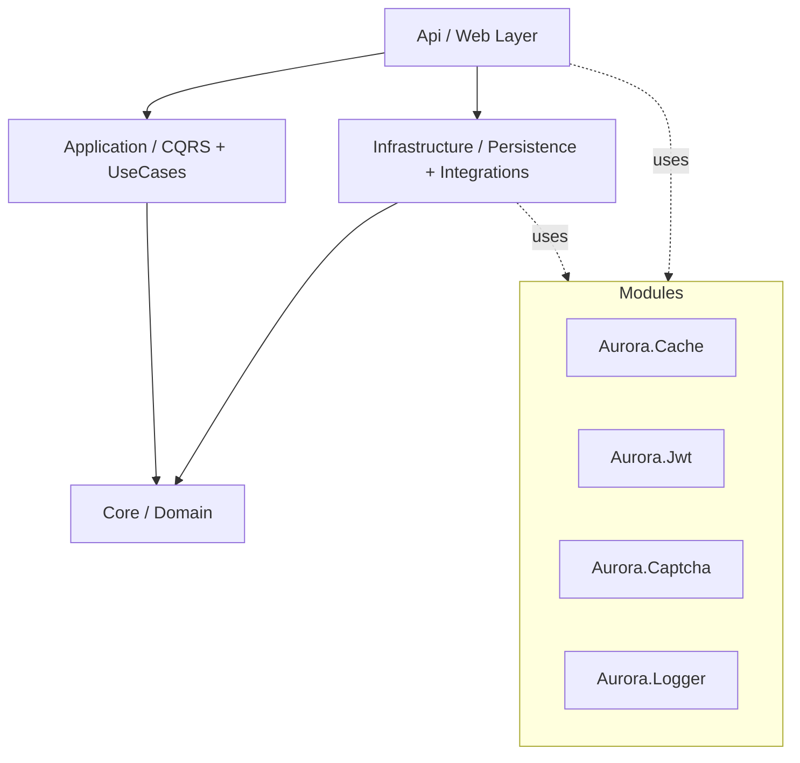
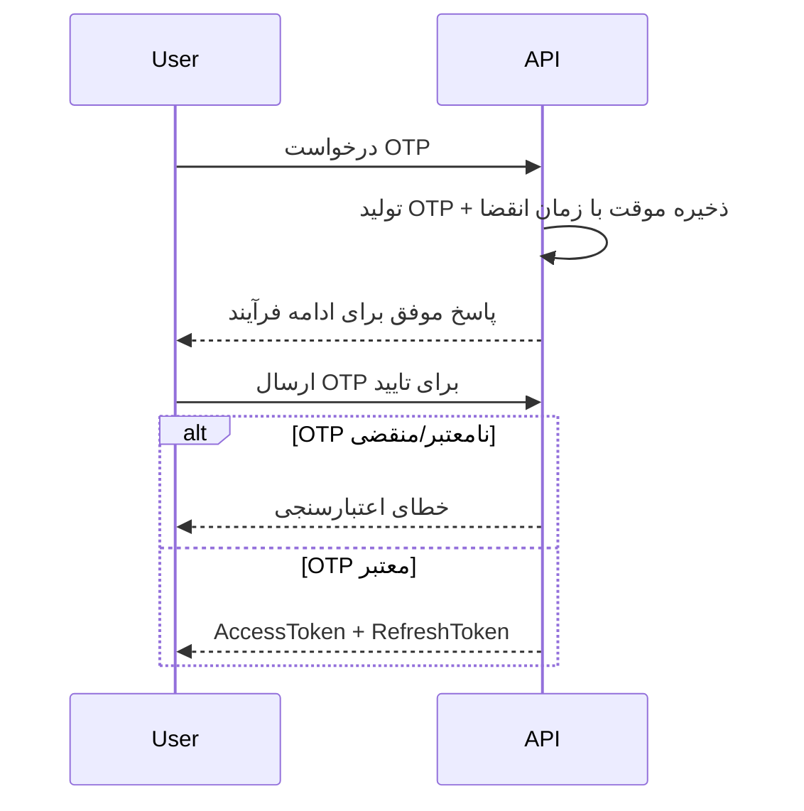

<div align="center">

# 🌟 AuroraBase

### قالب زیرساخت حرفه‌ای برای Web API با .NET 8 (Clean Architecture + CQRS)

[](https://dotnet.microsoft.com/)
[](https://learn.microsoft.com/dotnet/csharp/)
[](https://learn.microsoft.com/ef/core/)
[](LICENSE)

**AuroraBase** یک بویلرپلیت ماژولار برای ساخت APIهای مقیاس‌پذیر است که با تمرکز بر **معماری تمیز**، **CQRS**، **احراز هویت OTP + JWT**، **کشینگ** و **قابلیت نگهداری بالا** طراحی شده است.

[🚀 شروع سریع](#-شروع-سریع) •
[🏛️ معماری](#️-معماری-و-جریان-وابستگی) •
[📂 ساختار پروژه](#-ساختار-پروژه) •
[⚙️ پیکربندی](#️-پیکربندی) •
[🔐 امنیت](#-امنیت) •
[🤝 مشارکت](#-مشارکت)

</div>

---

## 📖 معرفی پروژه

در پروژه‌های واقعی، آماده‌سازی زیرساخت‌هایی مثل معماری استاندارد، مدیریت تراکنش، امنیت، لاگینگ و کش زمان‌بر است.  
**AuroraBase** این مسیر را با یک اسکلت حرفه‌ای و قابل توسعه کوتاه می‌کند تا تیم توسعه سریع‌تر روی منطق کسب‌وکار تمرکز کند.

---

## ✨ ویژگی‌های کلیدی

- ✅ **Clean Architecture** با جداسازی شفاف لایه‌ها
- ✅ **CQRS + MediatR** برای تفکیک Command/Query
- ✅ **Repository + Unit of Work** برای مدیریت تمیز دیتابیس و تراکنش
- ✅ **OTP Login** به‌عنوان جریان اصلی احراز هویت
- ✅ **JWT (Access/Refresh Token)** پس از اعتبارسنجی OTP
- ✅ **Aurora.Cache** برای کشینگ ماژولار (In-Memory/Distributed)
- ✅ **Aurora.Logger** برای لاگینگ ساختاریافته
- ✅ **Dual Pagination** (Offset + Cursor/Keyset) برای مقیاس بالا
- ✅ طراحی مناسب برای توسعه در محیط‌های Production

---

## 🏛️ معماری و جریان وابستگی

معماری پروژه بر اساس **Dependency Rule** در Clean Architecture است؛  
لایه‌های داخلی به لایه‌های خارجی وابسته نیستند.



### نقش لایه‌ها

- **Core**: موجودیت‌ها، قراردادها، قوانین دامنه
- **Application**: Use Caseها، Command/Query، Handlerها، Validation
- **Infrastructure**: EF Core، Repositoryها، پیاده‌سازی سرویس‌ها
- **Api**: Controllerها، Middlewareها، DI، تنظیمات اجرا

---

## 📂 ساختار پروژه

```text
AuroraBase/
├── Api/                        # لایه ارائه (Controllers, Middlewares, Startup/DI)
├── Application/                # CQRS (Commands, Queries, Handlers, Validators, DTOs)
├── Core/                       # Domain (Entities, Interfaces, Domain Rules)
├── Infrastructure/             # Persistence (DbContext, Repositories, Migrations)
├── Aurora.Cache/               # ماژول کش
├── Aurora.Captcha/             # موجود در پروژه (فعلاً در فلو عملیاتی استفاده نشده)
├── Aurora.ChacheSetting/       # تنظیمات/مدل‌های مرتبط با کش
├── Aurora.Jwt/                 # زیرساخت تولید و اعتبارسنجی JWT
├── Aurora.Logger/              # زیرساخت لاگینگ
└── Utils/                      # ابزارها و Extensionهای عمومی
```

---

## 🚀 شروع سریع

### پیش‌نیازها

- .NET SDK 8.0
- SQL Server
- (اختیاری) EF CLI:
  ```bash
  dotnet tool install --global dotnet-ef
  ```

### 1) کلون مخزن

```bash
git clone https://github.com/Rezakp3/AuroraBase.git
cd AuroraBase
```

### 2) تنظیم `appsettings.json`

فایل `Api/appsettings.json` را بر اساس محیط خود مقداردهی کنید:

```json
{
  "ConnectionStrings": {
    "DefaultConnection": "Server=YOUR_SERVER;Database=AuroraBaseDb;Trusted_Connection=True;TrustServerCertificate=True;"
  },
  "JwtSettings": {
    "SecretKey": "YOUR_SUPER_SECRET_KEY_SHOULD_BE_LONG_RANDOM_AND_SECURE",
    "Issuer": "AuroraBase",
    "Audience": "AuroraBaseUsers",
    "AccessTokenExpirationMinutes": 15,
    "RefreshTokenExpirationDays": 7
  },
  "CacheSettings": {
    "AbsoluteExpirationInMinutes": 60,
    "SlidingExpirationInMinutes": 10
  }
}
```

### 3) اعمال Migration

```bash
dotnet ef database update --project Infrastructure --startup-project Api
```

### 4) اجرای پروژه

```bash
cd Api
dotnet run
```

Swagger (نمونه):
`https://localhost:7001/swagger`

---

## ⚙️ پیکربندی

### ConnectionStrings
- `DefaultConnection`: رشته اتصال SQL Server

### JwtSettings
- `SecretKey`: کلید امضا (ترجیحاً طولانی و تصادفی)
- `Issuer`: صادرکننده
- `Audience`: مخاطب
- `AccessTokenExpirationMinutes`
- `RefreshTokenExpirationDays`

### CacheSettings
- `AbsoluteExpirationInMinutes`
- `SlidingExpirationInMinutes`

### OTP
- جریان اصلی ورود بر مبنای OTP است.
- تنظیمات دقیق OTP را مطابق پیاده‌سازی فعلی شما در لایه‌های `Application/Infrastructure` نگهداری و مدیریت کنید.

---

## 🔐 امنیت

وضعیت امنیت فعلی پروژه:

- ✅ **OTP Login** (جریان اصلی احراز هویت)
- ✅ **JWT Token Pair** (Access + Refresh) بعد از تایید OTP
- ✅ قابلیت اعمال **Role/Claim-based Authorization**
- ℹ️ ماژول **Aurora.Captcha** در پروژه وجود دارد اما **فعلاً فعال/استفاده نشده**

### فلو احراز هویت OTP



---

## ⚡ صفحه‌بندی پیشرفته (Dual Pagination)

پروژه از دو مدل صفحه‌بندی پشتیبانی می‌کند:

- **Offset/Page-Based**: ساده و مناسب داده‌های کم‌حجم
- **Cursor/Keyset-Based**: سریع و پایدار برای داده‌های حجیم

نمونه مقایسه کارایی (تقریبی):

| تعداد رکورد | Offset | Cursor | بهبود |
|---:|---:|---:|---:|
| 10,000 | 18ms | 2ms | 9x |
| 100,000 | 160ms | 4ms | 40x |
| 1,000,000 | 2200ms | 6ms | 366x |
| 10,000,000 | 29400ms | 9ms | 3260x |

> اعداد بسته به نوع کوئری، ایندکس و سخت‌افزار متفاوت خواهند بود.

---

## 🧩 ماژول‌های داخلی

- **Aurora.Jwt**: تولید/اعتبارسنجی JWT و مدیریت چرخه توکن
- **Aurora.Cache**: Abstraction برای کشینگ و افزایش کارایی
- **Aurora.Logger**: ثبت لاگ‌های ساختاریافته
- **Aurora.Captcha**: آماده استفاده، ولی در فاز فعلی پروژه غیرفعال

---

## 🛠️ توسعه و نگهداری

### پیشنهاد برای نام‌گذاری Branch
- `feature/...`
- `fix/...`
- `refactor/...`
- `chore/...`

### پیشنهاد برای پیام Commit
- `feat: ...`
- `fix: ...`
- `docs: ...`
- `refactor: ...`
- `chore: ...`

---

## 🤝 مشارکت

1. پروژه را Fork کنید  
2. یک Branch جدید بسازید:
   ```bash
   git checkout -b feature/your-feature
   ```
3. تغییرات را Commit کنید:
   ```bash
   git commit -m "feat: add your feature"
   ```
4. Push کنید:
   ```bash
   git push origin feature/your-feature
   ```
5. Pull Request بسازید

---

## 📌 نقشه راه پیشنهادی

- [ ] Docker / Docker Compose
- [ ] CI با GitHub Actions
- [ ] تست‌های Unit و Integration
- [ ] Observability (HealthCheck + Metrics + Tracing)
- [ ] Rate Limiting و Hardening امنیتی بیشتر

---

## 📜 License

این پروژه تحت مجوز **MIT** منتشر شده است.  
برای جزئیات بیشتر فایل [LICENSE](LICENSE) را بررسی کنید.
