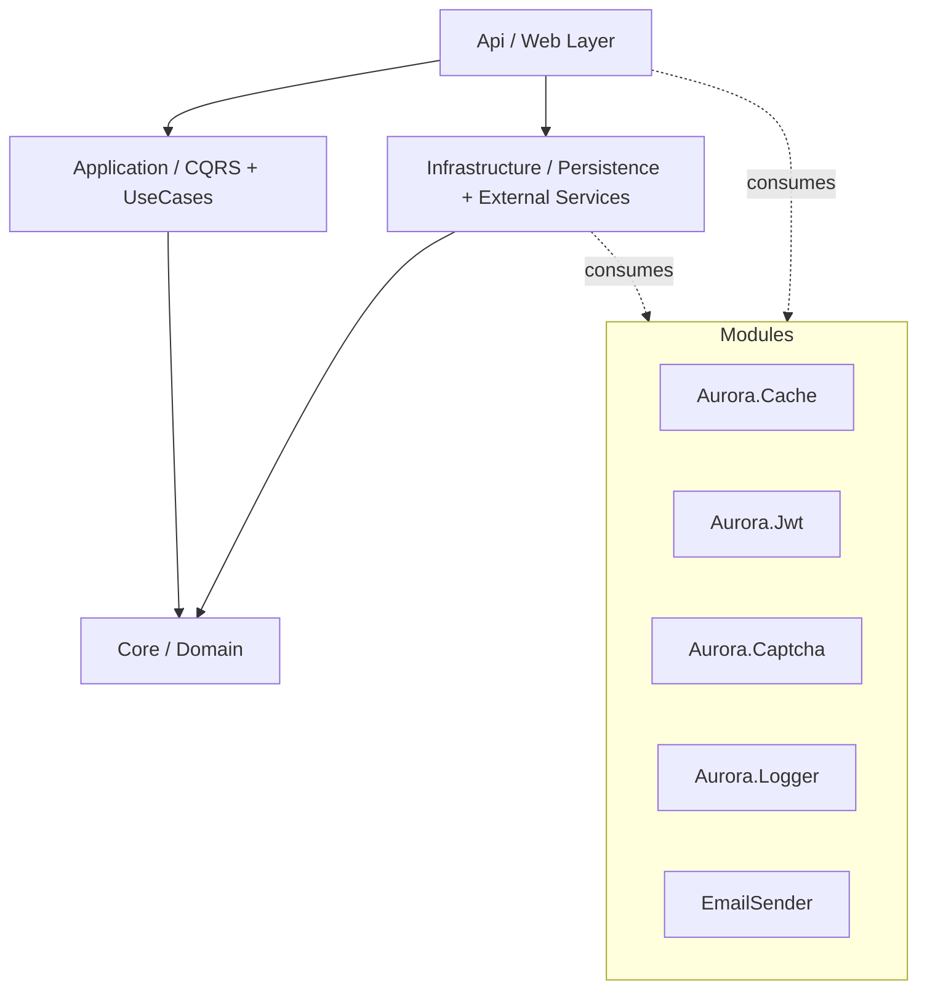
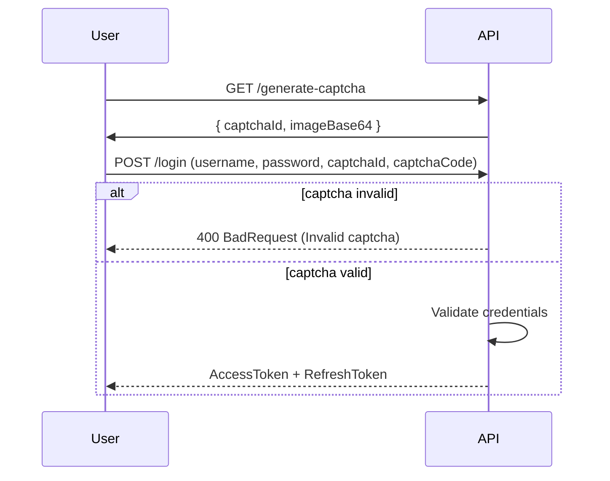

<div align="center">

# 🌟 AuroraBase

### Enterprise-Grade .NET 8 Web API Boilerplate (Clean Architecture + CQRS)

[](https://dotnet.microsoft.com/)
[](https://learn.microsoft.com/dotnet/csharp/)
[](https://learn.microsoft.com/ef/core/)
[](LICENSE)

**AuroraBase** یک بویلرپلیت حرفه‌ای برای توسعه Web API در مقیاس سازمانی است که با تمرکز بر  
**Clean Architecture**, **CQRS**, **امنیت چندلایه**, **کشینگ ماژولار** و **قابلیت توسعه‌پذیری بالا** طراحی شده است.

[🚀 شروع سریع](#-شروع-سریع) •
[🏛️ معماری](#️-معماری-و-جریان-وابستگی) •
[📦 ساختار پروژه](#-ساختار-پروژه) •
[⚙️ پیکربندی](#️-پیکربندی) •
[🔐 امنیت](#-امنیت) •
[🤝 مشارکت](#-مشارکت)

</div>

---

## 📖 معرفی

در پروژه‌های واقعی، پیاده‌سازی همزمان معماری تمیز، امنیت JWT، کپچا، کش، لاگینگ، اعتبارسنجی، و مدیریت تراکنش‌ها زمان‌بر و پرخطاست.  
AuroraBase این دغدغه‌ها را به‌صورت **زیرساخت آماده، قابل نگهداری و ماژولار** ارائه می‌دهد تا تیم توسعه بتواند سریع‌تر روی منطق کسب‌وکار تمرکز کند.

---

## ✨ ویژگی‌های کلیدی

- ✅ **Clean Architecture** با جداسازی کامل لایه‌ها
- ✅ **CQRS + MediatR** برای تفکیک دستورات و پرس‌وجوها
- ✅ **Repository + Unit of Work** برای مدیریت استاندارد دیتابیس
- ✅ **JWT Authentication (Access/Refresh Token)** به‌همراه Role/Claim
- ✅ **Captcha داخلی** برای جلوگیری از درخواست‌های مخرب
- ✅ **Caching ماژولار** (In-Memory / Distributed)
- ✅ **Structured Logging** برای مانیتورینگ و اشکال‌زدایی
- ✅ **Pagination دوگانه** (Offset + Cursor/Keyset) برای کارایی بالا
- ✅ **Validation** با الگوهای تمیز در لایه Application
- ✅ **آماده توسعه برای محیط Production**

---

## 🏛️ معماری و جریان وابستگی

معماری پروژه بر اساس **Dependency Rule** در Clean Architecture پیاده‌سازی شده:  
لایه‌های داخلی مستقل از فریم‌ورک و زیرساخت هستند.



### لایه‌ها

- **Core**: موجودیت‌ها، قراردادها، قواعد دامنه، Exceptionهای دامنه
- **Application**: Command/Query/Handler، DTO، Validation، Use Caseها
- **Infrastructure**: EF Core، Repositoryها، DbContext، Migrationها، سرویس‌های خارجی
- **Api**: Controllerها، Middlewareها، DI، تنظیمات Startup

---

## 📂 ساختار پروژه

```text
AuroraBase/
├── Api/                        # Presentation Layer (Controllers, Middleware, DI, Config)
├── Application/                # CQRS, Handlers, DTOs, Validators
├── Core/                       # Entities, Interfaces, Domain Exceptions
├── Infrastructure/             # EF Core, DbContext, Repositories, Migrations
├── Aurora.Cache/               # Caching abstraction & implementations
├── Aurora.Captcha/             # Captcha generator (Base64 + Id/Code flow)
├── Aurora.ChacheSetting/       # Cache config models/options
├── Aurora.Jwt/                 # JWT generation/validation services
├── Aurora.Logger/              # Logging infrastructure
├── EmailSender/                # SMTP email sender module
└── Utils/                      # Shared extensions/helpers
```

> نکته: اگر نام `Aurora.ChacheSetting` عمداً انتخاب نشده باشد، بهتر است در آینده به `Aurora.CacheSetting` اصلاح شود.

---

## 🚀 شروع سریع

## پیش‌نیازها

- .NET SDK 8.0
- SQL Server
- (اختیاری) ابزار EF Core CLI:
  ```bash
  dotnet tool install --global dotnet-ef
  ```

## 1) کلون پروژه

```bash
git clone https://github.com/Rezakp3/AuroraBase.git
cd AuroraBase
```

## 2) تنظیمات `appsettings.json`

فایل `Api/appsettings.json` را بر اساس محیط خود تنظیم کنید:

```json
{
  "ConnectionStrings": {
    "DefaultConnection": "Server=YOUR_SERVER;Database=AuroraBaseDb;Trusted_Connection=True;TrustServerCertificate=True;"
  },
  "JwtSettings": {
    "SecretKey": "YOUR_SUPER_SECRET_KEY_SHOULD_BE_LONG_RANDOM_AND_SECURE",
    "Issuer": "AuroraBase",
    "Audience": "AuroraBaseUsers",
    "AccessTokenExpirationMinutes": 15,
    "RefreshTokenExpirationDays": 7
  },
  "CacheSettings": {
    "AbsoluteExpirationInMinutes": 60,
    "SlidingExpirationInMinutes": 10
  }
}
```

## 3) اعمال Migration دیتابیس

```bash
dotnet ef database update --project Infrastructure --startup-project Api
```

## 4) اجرای API

```bash
cd Api
dotnet run
```

Swagger (نمونه):
`https://localhost:7001/swagger`

---

## ⚙️ پیکربندی

## ConnectionStrings

- `DefaultConnection`: رشته اتصال SQL Server

## JwtSettings

- `SecretKey`: کلید امضا (حداقل ۳۲ کاراکتر تصادفی و امن)
- `Issuer`: صادرکننده توکن
- `Audience`: مخاطب توکن
- `AccessTokenExpirationMinutes`: انقضای توکن دسترسی
- `RefreshTokenExpirationDays`: انقضای رفرش‌توکن

## CacheSettings

- `AbsoluteExpirationInMinutes`: انقضای مطلق
- `SlidingExpirationInMinutes`: انقضای لغزشی

## SMTP (در صورت استفاده از EmailSender)

- Host / Port / Username / Password / From  
(پیشنهاد: نگهداری امن با Secret Manager یا Environment Variables)

---

## 🔐 امنیت

AuroraBase امنیت را به‌صورت چندلایه پیاده‌سازی می‌کند:

- **JWT-based Auth** با Access/Refresh Token
- **Captcha validation** در فرایندهای حساس (مثل Login)
- **Role/Claim-based Authorization**
- **ورود/خروج امن و مدیریت session/token lifecycle**
- **قابلیت توسعه برای سیاست‌های پیشرفته (Rate limiting, lockout, etc.)**

### جریان نمونه Captcha + Login



---

## 📄 نمونه کدنویسی CQRS (خلاصه)

### Command

```csharp
public record CreateProductCommand(string Name, decimal Price, int Stock) : IRequest<Guid>;
```

### Validator

```csharp
public class CreateProductCommandValidator : AbstractValidator<CreateProductCommand>
{
    public CreateProductCommandValidator()
    {
        RuleFor(x => x.Name).NotEmpty().MaximumLength(150);
        RuleFor(x => x.Price).GreaterThan(0);
        RuleFor(x => x.Stock).GreaterThanOrEqualTo(0);
    }
}
```

### Handler

```csharp
public class CreateProductCommandHandler : IRequestHandler<CreateProductCommand, Guid>
{
    private readonly IUnitOfWork _unitOfWork;

    public CreateProductCommandHandler(IUnitOfWork unitOfWork) => _unitOfWork = unitOfWork;

    public async Task<Guid> Handle(CreateProductCommand request, CancellationToken cancellationToken)
    {
        var entity = new Product
        {
            Name = request.Name,
            Price = request.Price,
            Stock = request.Stock
        };

        await _unitOfWork.Products.AddAsync(entity);
        await _unitOfWork.SaveChangesAsync(cancellationToken);

        return entity.Id;
    }
}
```

---

## ⚡ Pagination پیشرفته (Offset + Cursor)

برای لیست‌های کوچک، Offset مناسب است.  
برای داده‌های حجیم، Cursor-based (Keyset) باعث پایداری زمان پاسخ می‌شود.

| حجم داده | Offset | Cursor | بهبود تقریبی |
|---:|---:|---:|---:|
| 10K | 18ms | 2ms | 9x |
| 100K | 160ms | 4ms | 40x |
| 1M | 2200ms | 6ms | 366x |
| 10M | 29400ms | 9ms | 3260x |

> اعداد بالا بنچمارک ادعایی پروژه هستند و بسته به ایندکس، سخت‌افزار، و کوئری واقعی تغییر می‌کنند.

---

## 🧪 تست و کیفیت (پیشنهادی)

اگر هنوز اضافه نشده، پیشنهاد می‌شود این موارد به پروژه افزوده شود:

- Unit Tests برای Handlerها و Domain rules
- Integration Tests برای API + DB
- Lint/Format (EditorConfig + analyzers)
- CI با GitHub Actions برای Build/Test/Publish

---

## 🛠️ راهنمای توسعه

### Branch naming پیشنهادی
- `feature/...`
- `fix/...`
- `refactor/...`
- `chore/...`

### Commit convention پیشنهادی
- `feat: ...`
- `fix: ...`
- `docs: ...`
- `refactor: ...`
- `test: ...`
- `chore: ...`

---

## 🤝 مشارکت

1. Fork کنید
2. Branch جدید بسازید:
   ```bash
   git checkout -b feature/your-feature-name
   ```
3. تغییرات را Commit کنید:
   ```bash
   git commit -m "feat: add ..."
   ```
4. Push کنید:
   ```bash
   git push origin feature/your-feature-name
   ```
5. Pull Request بسازید

---

## 🗺️ Roadmap پیشنهادی

- [ ] Dockerfile + docker-compose برای اجرای سریع
- [ ] GitHub Actions برای CI/CD
- [ ] Health Checks + Observability (OpenTelemetry)
- [ ] Centralized Exception Handling Middleware
- [ ] Multi-tenant readiness
- [ ] Seed data + demo scenarios
- [ ] API Versioning + Rate Limiting

---

## 📜 License

این پروژه تحت مجوز **MIT** منتشر شده است.  
برای جزئیات، فایل [LICENSE](LICENSE) را ببینید.

---

## 💬 تماس و پشتیبانی

اگر سوال، ایده یا باگی داشتید، لطفاً از طریق **Issues** در GitHub ثبت کنید:
`https://github.com/Rezakp3/AuroraBase/issues`
